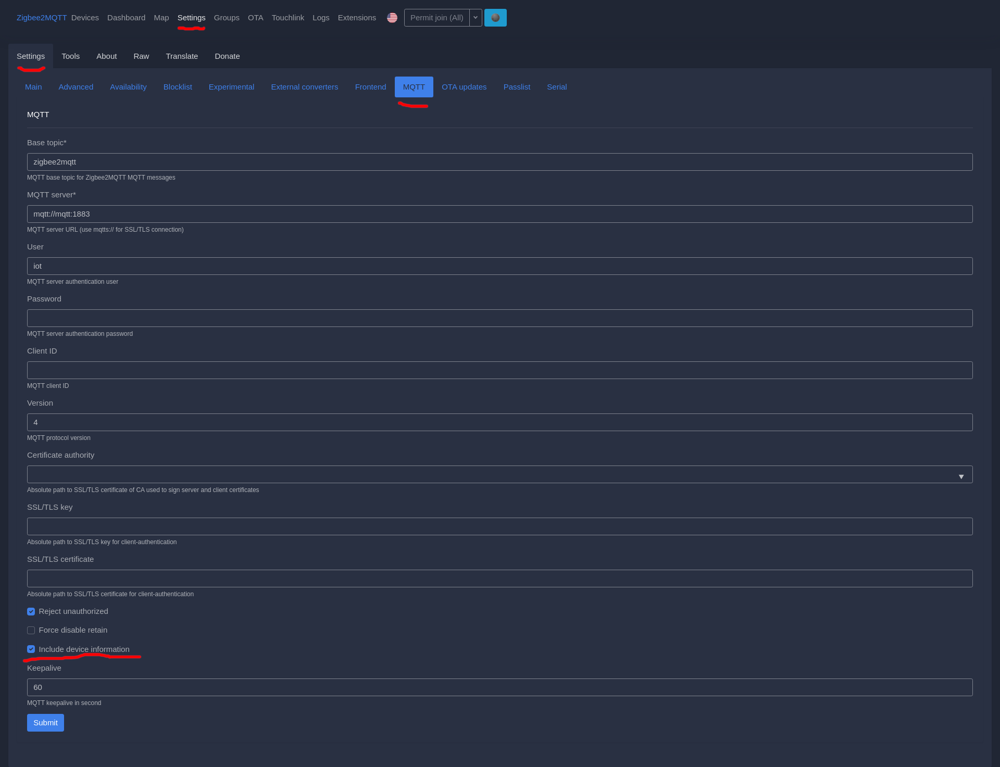
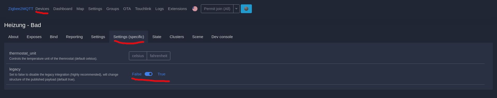
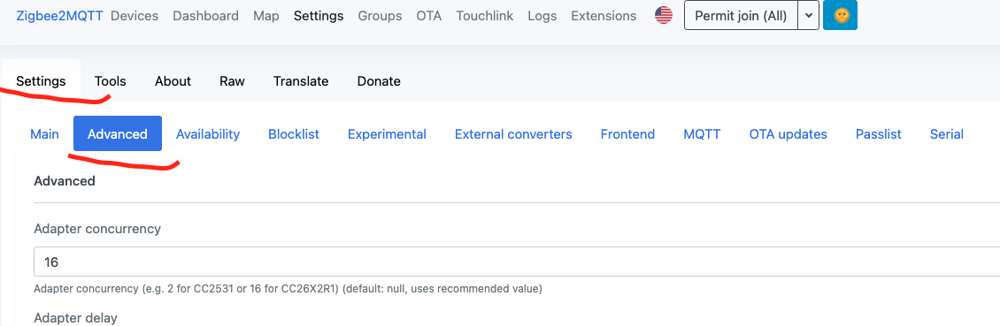
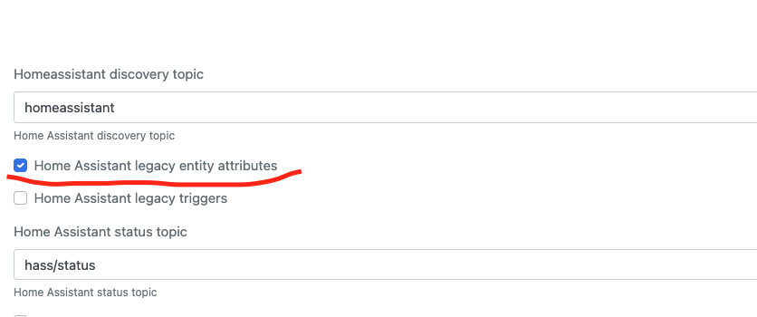

[](https://github.com/KartoffelToby/ai_thermostat/)
[](https://github.com/KartoffelToby/ai_thermostat/issues)
[](https://github.com/KartoffelToby/ai_thermostat/releases)
# AI THERMOSTAT for Zigbee2MQTT

**NICE TO KNOW: This, is still a kind of beta version if the main functions are stable it will be released as 1.0.0 version under the final name better_thermostat.**
**After 1.0 we swtich to Monthly releases**

**Tested with: HA: 2021.12.1 and Z2M: 1.22.1-1**

**You need at least HA: 2021.12 for 0.8.2 or higher**

**NEW: if you looking for a better thermostat ui too, checkout the [better-thermostat-ui-card](https://github.com/KartoffelToby/better-thermostat-ui-card) lovelace hacs frontend card.**

### Advance information:

- If you have a question or need help please create a new [discussion](https://github.com/KartoffelToby/ai_thermostat/discussions) or check if your question is already answered.
- If you have a suggestion, found a bug or want to add a new device or function create a new [issue](https://github.com/KartoffelToby/ai_thermostat/issues)
- If you want to contribute to this project create a new [pull request](https://github.com/KartoffelToby/ai_thermostat/pulls)

### Core features:

*Talke to me! What makes the ai_thermostat better?*

- simplifies your TRVs modes
- makes your TRVs full compatible to Google Home
- adds a window open detection with an external open/close sensor
- adds a summer shutdown with a weather entity or outdoor temperature sensor
- adds "better" room temperature based calibration with an external room termperature sensor, because it works moste of the time not good on the TRV.
- adds a scheduler for valve maintanance to prevent the valve to get stucked or noisy

This integration brings some smartness to your TRV Zigbee2MQTT setup.

What does it? Basically, it combines an external temperature sensor, window/door Sensors, and a weather-Entity, so your TRV is calibrated with the temperature from the external sensor and turned off if some window is open. It also turns off the thermostat if a configured outside temperature is reached for two days in a row, so if it's outside warm enough you didn't need useless heating in your rooms.

It's also useful for those who only need an off and heating state and controlled the room temperature with a set target temperature based on an external temperature sensor.

So if you use the Google Assistant integration to control your thermostat you no longer get into an issue of incompatible modes or the problem that a target temp can't be set because the device is in "auto" mode that's remapped to eco.

Youst set your Target Heat point with your voice or the Google Home app and you are good to go.

At this time following models are supported: (but basically all zigbee2mqtt TRV should work.)

---

- Eurotronic Spirit Zigbee (SPZB0001) (In Z2M device settings, set legacy to true) **normal calibration**
- Moes SEA801-Zigbee/SEA802-Zigbee (In Z2M device settings, set legacy to true) **normal calibration**
- TuYa TS0601_thermostat (TS0601) **target temperature calibration**
- Siterwell GS361A-H04 (GS361A-H04) **target temperature calibration**
- BRT-100-TRV (In Z2M device settings, set min temp to 5 and program mode to manual) **target temperature calibration** (will be switched to normal calibration if this is fixed [issue](https://github.com/Koenkk/zigbee2mqtt/issues/9486))

*All models that are not listed here uses the default wich is the **normal calibration** and expects that the TRV has system modes*

 **normal calibration**: means that the local_temperature_calibration setting in the TRV is used to sync the TRV internal current temperature with the connected room temperature sensor. The target temperature is settable over HA or directly on the TRV there are no restrictions

 **target temperature calibration**: means that the temperature sync is accomplished with a special target temperatur on the TRV, thats the reason why the target temperature displayed on the TRV is not the same as in HA, you only can ajust the target temperature via HA not the TRV itself. If you want more infos why, read [#15](/../../issues/15)

---

The SPZB0001 is Special, it uses the "heat" mode for boost and the auto mode for the "normal" operation, to avoid that it remaps heat with auto internally, the boost mode is lost with this configuration.

If you have a special Thermostat like the SPZB0001 feel free to open an issue or pull request.

The integration gets the Model identifier automatic, nothing to do here.


<br>
<br>

## Important config in Zigbee2Mqtt

**IMPORTANT: be sure to enable "legacy" in Zigbee2MQTT on the TRV devices and settings if you haven't the key local_temperature_calibration in your HA instance and include_device_information in the Zigbee2MQTT MQTT settings**

If you use Z2M with the HA Supervisor, make sure you set it in the configuration. otherwise it reset this option on every restart. [#57](/../../issues/57)

```yaml
mqtt:
  base_topic: zigbee2mqtt
  include_device_information: true
```


Switch on the global **include_device_information** under Settings > Mqtt > include_device_information.
<br>


Switch on the legacy setting in each of your TRV (if your TRV has this option, otherwise skip this step)
Make sure to disable the window detection and child protection modes, also make sure your TRV is not in a program mode
<br>


Switch on Home Assistant lagacy mode
<br>




## SETUP
You need to configure a "virtual" thermostat for every used thermostat.

Here is an example minimal configuration.
```yaml
climate:
  - platform: ai_thermostat
    name: room
    thermostat: climate.tvr
    temperature_sensor: sensor.temperature
    window_sensors: group.office_windows
```

Here is an example full configuration.
```yaml
climate:
  - platform: ai_thermostat
    name: room
    thermostat: climate.tvr
    temperature_sensor: sensor.temperature
    window_sensors: group.office_windows #if this is not set, the window open detection is off
    weather: weather.xxx #if this is set, the outdoor_sensor is ignored, remove the outdoor_sensor config!
    outdoor_sensor: sensor.outdoor_temperature #if you want to use it, remove the weather config!
    off_temperature: 20
    window_off_delay: 0
    valve_maintenance: false
    night_temp: 18
    night_start: '22:00'
    night_end: '06:00'
```

**IMPORTANT: the weather and outdoor_sensor are not required, but you need one of them, if you want to use this function, if not remove them**

Key | Example Value | Required? | Description
--- | --- | --- | ---
***platform*** | `ai_thermostat` | *yes* |
***name*** | `Thermostat - Livingroom` | *no* | Used to name the virtual thermostat
***thermostat*** | `climate.tvr` | *yes* | a zigbee2mqtt climate entity.
***unique_id*** | `392049` | *no* | A unique_id (e.g. UNIX timestamp) mostly needed when using google home.
***temperature_sensor*** | `sensor.temperature` | *yes* | a zigbee2mqtt sensor entity that is used for the actual temperature input of the thermostat.
***window_sensors*** | `group.livingroom_windows` | *no* | a group of window/door - sensors (see below) that are used for the open window detection of the thermostat (the thermostat doesn't need to support an open window detection for that feature). If you have only one window, you can pass the entity without the group.
***window_off_delay*** | `10` | *no* | Only set the thermostat to an OFF state if the window/door - sensors are open for X seconds. Default is 0 for an instant turnoff.
***weather*** | `weather.xxx` | *no* | a weather entity from Home Assistant to check the forecast to detect if heating is needed in use of the off_temperature (Meteorologisk Institutt (Metno)) if this is set the outdoor_sensor will be ignored
***outdoor_sensor*** | `sensor.outdoor_temperature` | *no* | a zigbee2mqtt sensor entity that is used for the outdoor temperature calculation in use of the off_temperature for the avg of the last two days.
***off_temperature*** | `20` | *no* | an int number as a temperature if the forecast outside temperature is above it the thermostat is turned off.
***valve_maintenance*** | `false` | *no* | This is a maintenance function that will prevent the valve to get stuck or make annoying sounds, the default is `false`. If set to `true` it will perform a valve open-close-procedure every five days
***night_temp*** | `18` | *no* | if this value is set, the night temperature reduction is active and set it to the temperature at night (to disable it, remove this setting or set it to -1) see also  night_start and night_end
***night_start*** | `23:00` | *no* | define the start time of the night for the night reduction (night_temp must be set) the TRV will be setted to the night temp
***night_end*** | `07:00` | *no* | define the end time of the night for the night reduction (night_temp must be set) the TRV will be setted back to the last active temp

### Example Window/Door - Sensor config

```yaml
livingroom_windows:
  name: Livingroom Windows
  icon: mdi:window-open-variant
  all: false
  entities:
    - binary_sensor.openclose_1
    - binary_sensor.openclose_2
    - binary_sensor.openclose_3
```

### Combine multiple TRV to one

Install the HACS [climate_group](https://github.com/daenny/climate_group) from @daenny

As each TRV has its own local_temperature and must be induvidually calibrated, you need to create a ai_thermostat for each TRV and then Groupe them:

Example:

```yaml
climate:
  - platform: ai_thermostat
    name: Ai - TRV - Office - 1
    thermostat: climate.real_trv_office_1
    temperature_sensor: sensor.temperatur_office_temperature
    window_sensors: group.office_windows
    weather: weather.home
    off_temperature: 20
    unique_id: 1
  - platform: ai_thermostat
    name: Ai - TRV - Office - 2
    thermostat: climate.real_trv_office_2
    temperature_sensor: sensor.temperatur_office_temperature
    window_sensors: group.office_windows
    weather: weather.home
    off_temperature: 20
    unique_id: 2
  - platform: climate_group
    name: "TRV - Office"
    temperature_unit: C
    entities:
      - climate.ai_trv_office_1
      - climate.ai_trv_office_2
```

---

## ☕ Supporters

If you want to support this project, you can ☕ [**buy a coffee here**](https://www.buymeacoffee.com/kartoffeltoby).

| User                                             | Donation |
| :----------------------------------------------- | :------- |
| Someone                                          | ☕ x 3  |
| Someone                                          | ☕ x 1  |

---

## ‎‍💻 Code Contributors

| User                                             |
| :----------------------------------------------- |
| [@RubenKelevra](https://github.com/RubenKelevra) |
| [@bruvv](https://github.com/bruvv)               |
| [@Cycor](https://github.com/Cycor)               |


<a href="https://www.buymeacoffee.com/kartoffeltoby" target="_blank"></a>
