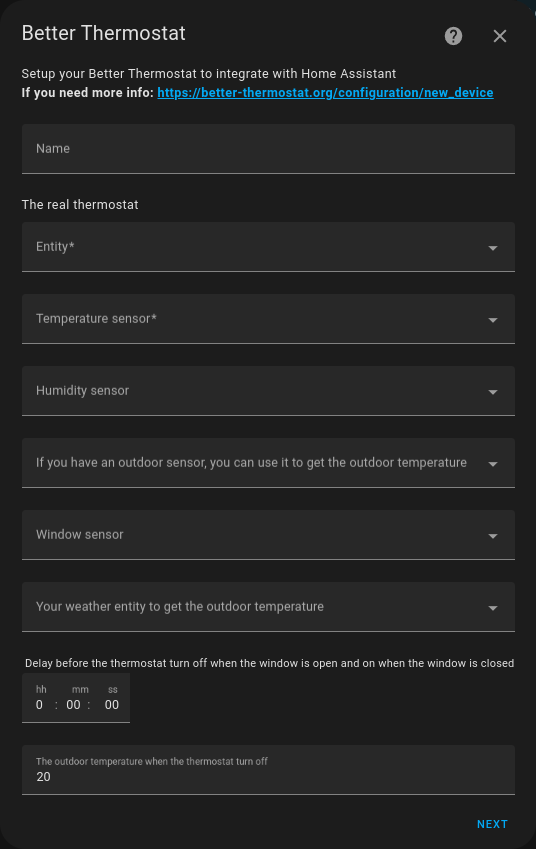

## Create a new Better Thermostat device

**Go to: `Settings` -> `Devices & Services` -> `Integrations` -> `+ Add Integration` -> `Better Thermostat`**

or click on the button below:

[](https://my.home-assistant.io/redirect/config_flow_start/?domain=better_thermostat)

## Configuration

## First step



**Name** This is a required field. It is the name of the virtual climate. It is used as an entity key name.

**The real thermostat** This is a required field. This is the real climate entity you want to control with BT, if you have more than one climate in your room you can select multiple climate entities, fill out the first field and a second one will appear.

**Temperature sensor** This is a required field. This is the temperature sensor you want to use to control the real climate entity. It's used to get a more accurate temperature reading than the sensor in the real climate entity because you can place it in the middle of the room and not close to the radiator.

**Humidity sensor** This is an optional field. For now, the humidity is only used to display it in the UI. In the future, it will be used to make a better calculation of the temperature or set it up to a *feels-like* temperature.

**If you have an outdoor sensor...** This field is optional. If you have an outdoor sensor you can use it to get the outdoor temperatures, this is used to set the thermostat on or off if the threshold (the last option in this screen) is reached. It uses a mean of the last 3 days and checks it every morning at 5:00 AM.

**Window Sensor** This is an optional field. If you have a window sensor you can use it to turn off the thermostat if the window is open and turn it on again when the window is closed. If you have more than one window in a room, you can also select window groups (see the GitHub page for more info).

### Example Window/Door - Sensor config

```yaml
group:
  livingroom_windows:
    name: Livingroom Windows
    icon: mdi:window-open-variant
    all: false
    entities:
      - binary_sensor.openclose_1
      - binary_sensor.openclose_2
      - binary_sensor.openclose_3
```

**Your weather entity for outdoor temperature** This is an optional field. It should be empty if you have an outdoor sensor. This is the weather entity you want to use to get the outdoor temperature. It uses the mean of the last 3 days and checks it every morning at 5:00 AM.

**Window delay** This is an optional field. If you don't want to turn off the thermostat instantly when the window is open, you can set a delay. This goes in both directions, so if you want to turn it on again after the window is closed, you can set a delay here too.

**The outdoor temperature threshold** This is an optional field. If you have an outdoor sensor or a weather entity, you can set a threshold. If the outdoor temperature is higher than the threshold, the thermostat will be turned off. If the outdoor temperature is lower than the threshold, the thermostat will be turned on. If you don't have an outdoor sensor or a weather entity, this field will be ignored.

**Tolerance** This is an optional field. It helps prevent the thermostat from turning on and off too often. Here is an example of how it works: If you set the target temperature to 20.0 and the tolerance to 0.3 for example. Then BT will heat to 20.0 and then go to idle until the temperature drops again to 19.7 and then it will heat again to 20.0.

## Second step


**Calibration Type** This is a required field. How the calibration should be applied on the TRV (Target temp or offset)

- ***Target Temperature Based***: Apply the calibration to the target temperature.

- ***Offset Based***: Apply the calibration to the offset. This will not be an option if your TRV doesn't support offset mode.

**Enhanced Compatibility:**

- **NUMBER entities**: Traditional numeric offset controls (most TRVs)
- **SELECT entities**: Dropdown-based offset selection (e.g., HomeMatic IP with predefined offset values like "1.5k", "2.0k")
- **Automatic Detection**: Better Thermostat automatically detects and supports both entity types

**HomeMatic IP/CCU Integration:**

When using HomeMatic IP or CCU thermostats, Better Thermostat automatically detects and uses SELECT entities for temperature offset calibration. These entities provide predefined offset values (like "1.5k", "2.0k", "2.5k") and are fully supported for offset-based calibration.

**⚠️ Important Setup Required:** For HomeMatic IP/CCU devices, the `temperature_offset` SELECT entity is hidden by default. You must explicitly enable it before it can be used with Better Thermostat:

1. Navigate to your HomeMatic integration settings
2. Go to **"Advanced settings"**
3. Click **"UN-IGNORE parameters"**
4. Enable the temperature offset parameter for your device model. The exact parameter path varies by model, for example:
   - **`TEMPERATURE_OFFSET:MASTER@HM-CC-RT-DN`** (HomeMatic Classic)
   - **`TEMPERATURE_OFFSET:MASTER@HM-CC-RT-DN-BoM`** (HomeMatic Classic BoM variant)
   - **`TEMPERATURE_OFFSET:MASTER@HmIP-eTRV`** (HomeMatic IP)

   Check your device manual or the HomeMatic integration's device parameter list for the correct parameter name.

Only after this activation, the `select.{room}_temperature_offset` entity becomes available for Better Thermostat to use. This setup is confirmed for the HACS integration "Homematic(IP) Local for OpenCCU" - it may differ slightly for other HomeMatic integrations.

**Calibration Mode**  This is a required field. It determines how the calibration should be calculated

Better Thermostat offers several algorithms to control your heating:

- ***Normal***: Simple and reliable - uses your external sensor to correct the TRV's internal sensor
- ***Aggressive***: Pushes the TRV harder for faster heating (good for slow-heating rooms)
- ***AI Time Based***: **[Recommended]** Learns your room's heating patterns and adapts automatically
- ***MPC Predictive***: Advanced algorithm that predicts temperature changes for optimal efficiency
- ***PID Controller***: Classic control method that responds well to varying heating conditions
- ***TPI Controller***: Simple duty-cycle based control for consistent heating

**→ [Learn more about each algorithm and which one to choose](algorithms)**

**Quick guide:**

- First-time user? → Start with **AI Time Based** (default)
- Room heats slowly? → Try **Aggressive**
- Temperature overshoots? → Try **MPC Predictive**
- Want fine control? → Try **PID Controller**
- **Using HomeMatic IP/CCU?** → Offset-based calibration now supports SELECT entities automatically

**Overheating protection** This should only be checked if you have any problems with strong overheating.

**If your TRV can't handle the off mode, you can enable this to use target temp 5° instead** If your TRV model doesn't have an off mode, BT will use the min target temp of this device instead, this option is only needed if you have problems, known models that don't have an off mode are auto-detected by BT.

**If auto means heat for your TRV and you want to swap it** Some climates in HA use the mode auto for default heating, and a boost when mode is heat. This isn't what we want, so if this is the case for you, check this option.

**Ignore all inputs on the TRV like a child lock** If this option is enabled, all changes on the real TRV, even over HA, will be ignored or reverted, only input from the BT entity is accepted.

**If you use HomematicIP you should enable this...** If your entity is a HomematicIP entity this option should be enabled, to prevent a duty cycle overload.
