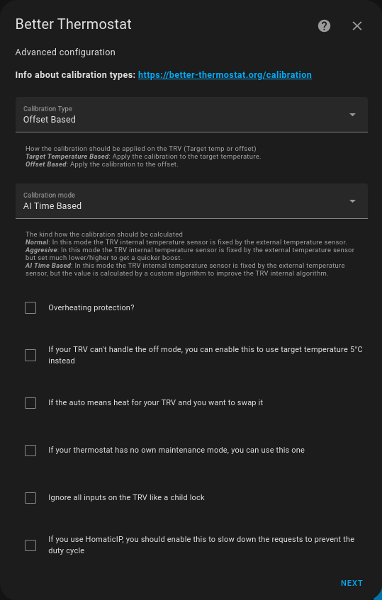

## Create a new Better Thermostat device

**Go to: `Settings` -> `Devices & Services` -> `Integrations` -> `+ Add Integration` -> `Better Thermostat`**

or click on the button below:

[](https://my.home-assistant.io/redirect/config_flow_start/?domain=better_thermostat)

## Configuration

## First step


**Name** This is a required field. It is the name of the virtual climate. It is used as an entity key name.

**The real thermostat** This is a required field. This is the real climate entity you want to control with BT. If you have more than one climate in your room, select all of them in this field. A Better Thermostat cannot be selected here, and a climate entity that accepts no target temperature is refused; both rules hold for the cooling device as well.

**The cooling device (optional)** This is an optional field. A climate entity used for cooling, such as an air conditioner. BT controls it alongside the TRVs; the tolerance section below describes how the cooling band works.

**Temperature sensor** This is a required field. This is the temperature sensor you want to use to control the real climate entity. It's used to get a more accurate temperature reading than the sensor in the real climate entity because you can place it in the middle of the room and not close to the radiator.

**Humidity sensor** This is an optional field. For now, the humidity is only used to display it in the UI. In the future, it will be used to make a better calculation of the temperature or set it up to a *feels-like* temperature.

**Outdoor temperature sensor** This field is optional. If you have an outdoor sensor you can use it to get the outdoor temperature, which turns the thermostat on or off against the outdoor temperature threshold (see below). BT does not compare the current reading but a damped outdoor temperature, the way heating controllers do: a running average over roughly the last day, in which each reading counts for as long as it was current. A sensor that reports every tenth of a degree while the sun heats it therefore weighs no more than one that reports rarely, and a warm afternoon moves the value only a little. At startup BT fills the damped temperature from the sensor's recorded history of the last three days; without recorded history it starts at the current reading. It checks at startup, every morning at 5:00 AM and whenever the outdoor sensor reports a new value. Mount the sensor in the shade, on a north wall and out of the rain: a sensor in the sun reads well above the air temperature, and no averaging removes that entirely. [Summer mode](/deep-explanations/summer-mode/) explains the decision in detail.

**Window Sensor** This is an optional field. If you have a window sensor you can use it to turn off the thermostat if the window is open and turn it on again when the window is closed. If you have more than one window in a room, you can also select window groups (see the example below).

### Example window/door sensor config

```yaml
group:
  livingroom_windows:
    name: Livingroom Windows
    icon: mdi:window-open-variant
    all: false
    entities:
      - binary_sensor.openclose_1
      - binary_sensor.openclose_2
      - binary_sensor.openclose_3
```

**Door sensor** This is an optional field. It works like the window sensor and has its own delays: an open door turns the thermostat off, and heating resumes once every configured window and door reports closed. See the [door sensor page](/faq/door-sensor) for the accepted states.

**Weather entity to get the outdoor temperature** This is an optional field. It should be empty if you have an outdoor sensor: when both are set, the outdoor sensor decides. BT averages the forecast for roughly the next 2 days, taking each day of a daily forecast as the mean of its high and low, and damps the entity's current temperature over roughly the last day, the same way as an outdoor sensor's readings; heating is allowed while either one is below the outdoor temperature threshold (see below for when a thermostat that was turned off resumes). The weather entity has to provide a forecast. BT checks it every hour.

**Delay before the thermostat should turn off when the window is opened** and **Delay before the thermostat should turn on when the window is closed** These are optional fields. The first one delays turning off after a window opens, the second one delays turning on again after it closes. Accepted sensor states and the exact debounce behavior are described on the [window sensor page](/faq/window-sensor).

**Delay before the thermostat should turn off when the door is opened** and **Delay before the thermostat should turn on when the door is closed** The same two delays for the door sensor.

**The outdoor temperature when the thermostat should turn off** This is an optional field. If you have an outdoor sensor or a weather entity, you can set a threshold. Once the outdoor temperature reaches the threshold, the thermostat is turned off. It is turned on again once the outdoor temperature drops 1 °C (1.8 °F) below the threshold, so an outdoor temperature that hovers around the threshold does not switch it on and off repeatedly. If you don't have an outdoor sensor or a weather entity, this field will be ignored.

**Enabled Presets** Choose which presets this thermostat offers. Each enabled preset gets its own number entity for its temperature, see [Presets](/setup/presets/).

**Tolerance** This is an optional field. It helps prevent the thermostat from turning on and off too often. Here is an example of how it works: If you set the target temperature to 20.0 and the tolerance to 0.3 for example. Then BT will heat to 20.0 and then go to idle until the temperature drops again to 19.7 and then it will heat again to 20.0. If you configured a cooler, the tolerance delays the switch-on instead of advancing it: with a cooling target of 24.0 and a tolerance of 0.3, BT starts cooling once the temperature reaches 24.3 and keeps cooling until it is back below 24.0. The cooling band is never narrower than 0.2, so with a tolerance of 0.1 cooling still starts at 24.1, but it keeps running until the temperature is back below 23.9.

**Target minimum temperature** and **Target maximum temperature** The range you can set on this thermostat. Leave both on *Auto* to use the range your devices report, or pick a value to narrow it. The minimum must not be above the maximum.

**Target temperature step** How much the target changes with one press of the plus or minus button.

## Second step



**Calibration Type** This is a required field. How the calibration should be applied on the TRV (target temperature, offset or valve opening)

- ***Target Temperature Based***: Apply the calibration to the target temperature.

- ***Offset Based***: Apply the calibration to the offset. This will not be an option if your TRV doesn't support offset mode.

- ***Direct Valve Based***: Set the valve opening directly. This is only offered when your TRV exposes a writable valve position. The valve opening comes from the calibration mode: AI Time Based, MPC Predictive, MPC v2, TPI Controller and PID Controller produce one. The other modes send a target temperature, as with Target Temperature Based.

The preselected type is Offset Based if your TRV supports it, otherwise Direct Valve Based if it supports valve control, otherwise Target Temperature Based.

**Enhanced Compatibility:**

- **NUMBER entities**: Traditional numeric offset controls (most TRVs)
- **SELECT entities**: Dropdown-based offset selection (e.g., HomeMatic IP with predefined offset values like "1.5k", "2.0k")
- **Automatic Detection**: Better Thermostat automatically detects and supports both entity types

**HomeMatic IP/CCU Integration:**

When using HomeMatic IP or CCU thermostats, Better Thermostat automatically detects and uses SELECT entities for temperature offset calibration. These entities provide predefined offset values (like "1.5k", "2.0k", "2.5k") and are fully supported for offset-based calibration.

**⚠️ Important Setup Required:** For HomeMatic IP/CCU devices, the `temperature_offset` SELECT entity is hidden by default. You must explicitly enable it before it can be used with Better Thermostat:

1. Navigate to your HomeMatic integration settings
2. Go to **"Advanced settings"**
3. Click **"UN-IGNORE parameters"**
4. Enable the temperature offset parameter for your device model. The exact parameter path varies by model, for example:
   - **`TEMPERATURE_OFFSET:MASTER@HM-CC-RT-DN`** (HomeMatic Classic)
   - **`TEMPERATURE_OFFSET:MASTER@HM-CC-RT-DN-BoM`** (HomeMatic Classic BoM variant)
   - **`TEMPERATURE_OFFSET:MASTER@HmIP-eTRV`** (HomeMatic IP)

   Check your device manual or the HomeMatic integration's device parameter list for the correct parameter name.

Only after this activation, the `select.{room}_temperature_offset` entity becomes available for Better Thermostat to use. This setup is confirmed for the HACS integration "Homematic(IP) Local for OpenCCU" - it may differ slightly for other HomeMatic integrations.

**Calibration Mode**  This is a required field. It determines how the calibration should be calculated

Better Thermostat offers several algorithms to control your heating:

- ***(AI) Time Based (Default)***: **[Recommended]** Learns your room's heating patterns and adapts automatically
- ***External Sensor Offset Only***: Simple and reliable - uses your external sensor to correct the TRV's internal sensor
- ***MPC Predictive (Beta)***: Predicts how the room temperature will change and sets its correction ahead of time. Still in testing
- ***(AI) MPC v2 (QP + Kalman, experimental)***: Experimental predictive controller written for TRVs with direct valve control
- ***Aggressive***: Pushes the TRV harder for faster heating (good for slow-heating rooms)
- ***TPI Controller***: Simple duty-cycle based control for consistent heating
- ***PID Controller***: Classic control method that responds well to varying heating conditions
- ***No Calibration***: BT passes your target temperature to the TRV unchanged and writes no offset

**→ [Learn more about each algorithm and which one to choose](/calibration_algorithms/)**

**Quick guide:**

- Start with AI Time Based, the default
- Switch to Aggressive if the room heats slowly
- Switch to TPI Controller if the temperature overshoots
- Switch to PID Controller if you want fine control
- On HomeMatic IP/CCU, offset-based calibration handles SELECT entities automatically

**MPC v2 room size** Only used by the MPC v2 mode. *Auto (use learned heat-loss rate)* derives the room model from the heat-loss rate BT has learned; the small, medium and large room presets start from a fixed model for a room of about 10, 20 or 40 m² instead.

**Overheating protection?** Enabled by default. Some TRVs don't close the valve completely when the temperature is reached, or the radiator holds a lot of residual heat. While the thermostat is idle, this option adds a correction that holds the TRV further closed. It only acts in the AI Time Based and Aggressive modes; the other modes ignore it.

**Use the minimum temperature instead of 'off'** With this option, BT sends the TRV its own minimum target temperature instead of switching it off. A TRV that reports its minimum temperature counts as switched off: once every TRV of the room is off and no window or door is open, the room switches off, and turning a knob up switches it back on. A TRV that lists no 'off' mode gets the minimum temperature without this option, because BT reads the modes the TRV reports. Enable it for a TRV whose 'off' mode does not work, or for a TRV without an 'off' mode whose knob should switch BT on and off.

**If 'auto' means 'heat' for your TRV and you want to swap it** Some climates in HA use the mode auto for default heating, and a boost when mode is heat. This isn't what we want, so if this is the case for you, check this option.

**If your thermostat has no own maintenance mode, you can use this one** If enabled, BT periodically opens and closes the valve so it does not get stuck, for TRVs that have no maintenance routine of their own. The climate entity shows the next run in its `next_valve_maintenance` attribute.

**Ignore all inputs on the TRV like a child lock** If this option is enabled, all changes on the real TRV, even over HA, will be ignored or reverted, only input from the BT entity is accepted. BT also creates a *Child Lock* switch per TRV. It toggles this option and, where the TRV has a child lock entity of its own, that one too.

**If you use HomematicIP, you should enable this to slow down the requests to prevent the duty cycle** If your entity is a HomematicIP entity this option should be enabled, to prevent a duty cycle overload. It is pre-enabled when the TRV's integration name contains "homematic". With it, BT writes to the TRV at most once every ten minutes; the first target change after you adjust the thermostat still goes out at the normal pace.
