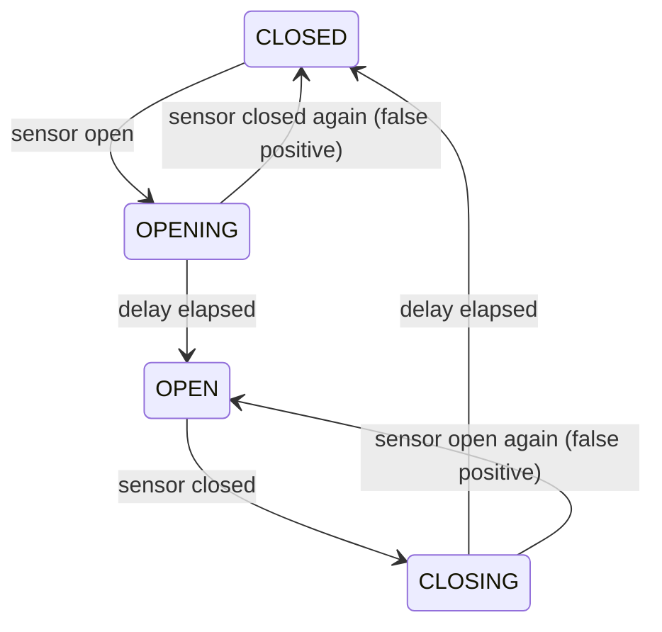
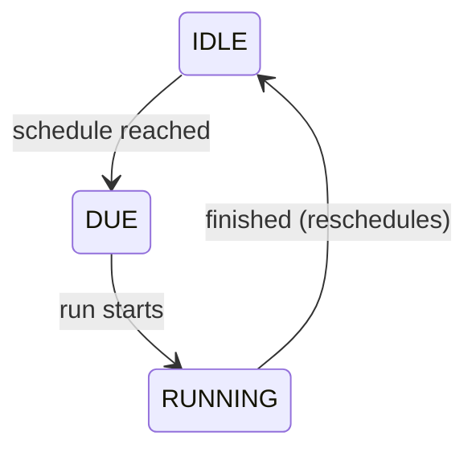
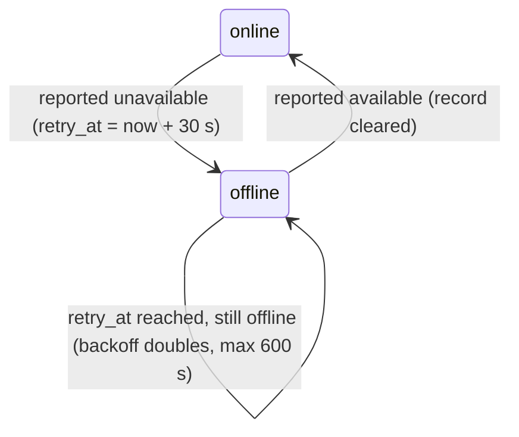

Seven small, orthogonal state machines built from `core/fsm/` hold the
discrete concerns: is a window open, is maintenance running, which
fail-soft rung applies. Together they form the **regions** of the
`KernelState`, and the door region is a second instance of the window
machine. Two rules hold everywhere:

1. **Regions gate, controllers compute.** A region decides *whether*
   heating may happen; the continuous controllers (PID/MPC/TPI) decide
   *how much*. The two never mix.
2. **Regions never read each other's internals.** They compose through
   their inputs and through the decision cascade's precedence: data
   influence is allowed, state peeking is not.

All regions are plain frozen dataclasses with pure transition
functions; none of them is persisted across restarts. They re-derive
from live observations: lifecycle through the startup sequence,
window/door/maintenance/mode from the first events, the ladder within
one debounce window, and reachability from the first snapshot (it
debounces nothing).

## Window: debounced open/closed

The *committed* phase rules the control law while a change is pending
(`effective_open` is true in OPEN and CLOSING). The region owns the
debounce timing: the queue handler sleeps exactly the remaining delay
the region asks for, re-reads the sensor, and re-steps until no
transition is pending. A delay reconfigured mid-flight changes the next
sleep, and a sensor that reverted cancels the transition. With a delay
of zero, the transition commits at the event itself.

## Door: a second window machine

The `door` region is a second instance of the window state machine,
fed by the door sensors with its own open/close delays. Window and
door gate independently: either region being effectively open turns
every TRV off without touching the mode. When both are open, the
window suppression reason wins the annunciation.

## Maintenance: valve exercise with a liveness bound

The region exists to guarantee one invariant: a maintenance run must
never block control permanently. `is_blocking()` stops honoring a RUNNING
phase once it exceeds the maximum runtime (one hour), and finishing a
run always returns to IDLE. An open window postpones the schedule by an
hour; without any maintenance-enabled TRV the next check moves a week
out. The HVAC mode is not a postpone reason: a valve held shut through a
summer with the heating off is the one that seizes, so the exercise
runs with the thermostat set to OFF as well.

## Lifecycle: startup, running, stopped

INITIALISING → STARTING (grace) → RUNNING → STOPPING. While startup
runs, `decide()` addresses no TRVs; the initial device sync happens
right after the startup-finished transition. The grace window also
defers the degraded-mode warning so slow cloud integrations get time to
come online before the user sees a repair issue.

## Mode: the user's HVAC mode

A validated mirror of the user's selected mode (off / heat / cool /
heat-cool / auto), with the preset axis orthogonal to it. The mode tier
of the cascade reads it; setting the mode on the entity advances the
region.

## Control mode: the fail-soft ladder

OPTIMAL → SENSOR_FALLBACK → HOLD. Downgrades commit after ~2 minutes of
sustained capability loss; upgrades only after ~5 minutes of sustained
recovery. The asymmetry is hysteresis against flapping sensors. What
each rung does is described under
[Safety and degradation](/internals/safety-and-degradation/).

## Reachability: per-TRV online/offline

Tracks per TRV since when it is offline (`offline_since`), how many
retries have elapsed (`retry_count`), and when the next one is due
(`retry_at`). The region steps inside `decide()` on every snapshot and
debounces nothing. The backoff starts at 30 seconds and doubles up to
ten minutes (`RETRY_INITIAL_S`, `RETRY_MAX_S`).

The shell consumes `retry_at`. Each cycle that skips an offline TRV
queues one control cycle for the region's `retry_at`
(`_schedule_reachability_retry` in `utils/controlling.py`, at most one
pending per TRV). That cycle writes nothing to the offline TRV; it
re-observes it, and while the TRV stays offline the region advances the
backoff and the next retry is queued. A TRV coming back normally queues
a cycle through its own state event; the retry cycles cover a return
that did not, so an offline TRV is re-checked at least every ten
minutes.

The effect on control is an address filter rather than a cascade tier:
unreachable TRVs are dropped from the commanded set and receive no
intent (except while boost heating is active, which keeps commanding so
the TRV catches up the moment it returns). The record also lands in the
flight recorder, where it serves outage analysis.
