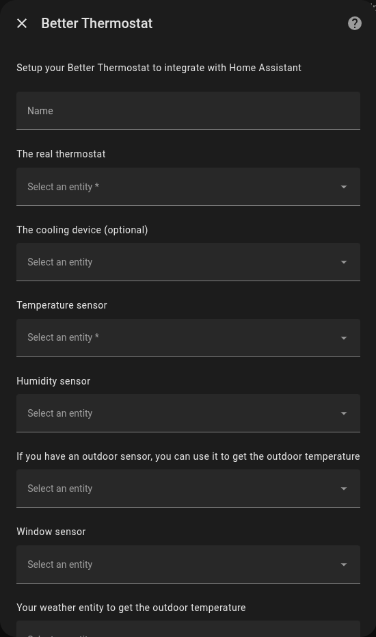
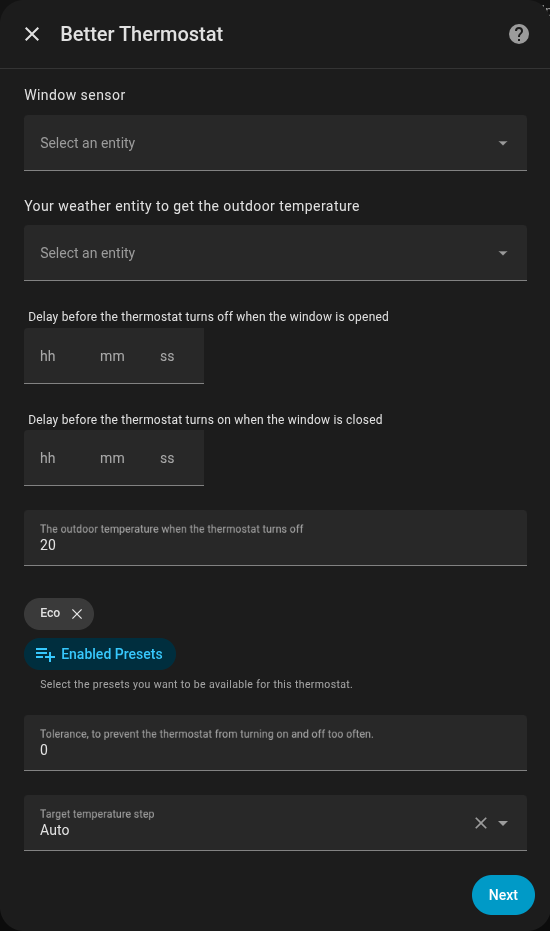
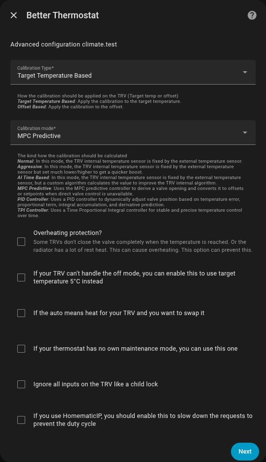

This page explains the two setup screens in plain language and gives practical defaults.

## Screen 1: Room and sensors

<div style="display: grid; grid-template-columns: repeat(auto-fit, minmax(300px, 1fr)); gap: 2rem; align-items: start;">

<div>





</div>

<div>

- **Name**: A friendly name for this room's thermostat (e.g., "Living Room Heating").
- **The real thermostat**: Select the smart radiator valves or thermostats in this room.
- **The cooling device (optional)**: If you have an AC or cooler, select it here to control it alongside your heating.
- **Temperature sensor**: Your separate room temperature sensor. Accurate control depends on this one.
- **Humidity sensor**: Currently just displays the humidity on your dashboard.
- **Outdoor temperature sensor**: Select your outdoor sensor to let the system know when it's warm outside.
- **Window sensor**: Select your window sensor so the heating pauses automatically when you open a window.
- **Door sensor**: Works like the window sensor, with its own delays. Heating resumes once every window and door is closed. See [Door sensor states](/faq/door-sensor).
- **Weather entity to get the outdoor temperature**: An alternative to a physical outdoor sensor (like a weather forecast integration).
- **Delay before the thermostat should turn off when the window is opened**: How long to wait after opening a window before pausing the heat (prevents pausing if you just open it for a quick second).
- **Delay before the thermostat should turn on when the window is closed**: How long to wait after closing the window before resuming heat.
- **Delay before the thermostat should turn off when the door is opened** / **Delay before the thermostat should turn on when the door is closed**: The same two delays for the door sensor.
- **The outdoor temperature when the thermostat should turn off**: If it gets warmer than this outside, the heating turns off automatically to save energy and money.
- **Enabled Presets**: Choose which modes you want to use (like Eco mode for saving energy while away).
- **Tolerance, to prevent the thermostat from turning on and off too often**: A small temperature buffer so your heater doesn't constantly click on and off if the temperature fluctuates slightly.
- **Target minimum temperature** / **Target maximum temperature**: The range you can set on this thermostat. Leave both on *Auto* to use the range your devices report, or pick a degree to narrow it — a nursery held above 16°C, say. The minimum must not be above the maximum.
- **Target temperature step**: How much the temperature changes when you press the plus or minus buttons (e.g., 0.5°C).

</div>

</div>

### Window sensor group example

```yaml
group:
  livingroom_windows:
    name: Livingroom Windows
    icon: mdi:window-open-variant
    all: false
    entities:
      - binary_sensor.openclose_1
      - binary_sensor.openclose_2
      - binary_sensor.openclose_3
```


## Screen 2: Calibration and behavior

<div style="display: grid; grid-template-columns: repeat(auto-fit, minmax(300px, 1fr)); gap: 2rem; align-items: start;">

<div>



</div>

<div>

### Calibration type

How should Better Thermostat control your radiator?

- **Target Temperature Based**: The safest choice. It tricks your radiator into heating more or less by changing its target temperature. Works with almost all devices.
- **Offset Based**: Uses your device's built-in calibration feature, if it has one. Preselected when your device supports it.
- **Direct Valve Based**: Sets the valve opening directly. Only offered when your device exposes a writable valve position, and only AI Time Based, MPC Predictive, MPC v2, TPI Controller and PID Controller use it; the other modes fall back to a target temperature.

Some devices expose offset as a `number`, others as a `select`. Better Thermostat supports both.

### Calibration mode

This is the "brain" of Better Thermostat. How should it calculate the heating?

- **(AI) Time Based (Default)**: **Recommended for most users.** A smart algorithm that learns and adjusts to keep the temperature stable.
- **External Sensor Offset Only**: Basic mode. It just syncs the temperature from your room sensor to the radiator.
- **MPC Predictive (Beta)**: Predicts how your room heats up and sets its correction ahead of time. Still in testing.
- **(AI) MPC v2 (QP + Kalman, experimental)**: An experimental predictive controller for devices with direct valve control.
- **Aggressive**: Heats up faster by pushing the radiator harder while heating, but might overshoot your target temperature.
- **TPI Controller**: Turns the temperature error into a duty cycle and holds the valve open by that share.
- **PID Controller**: A mathematical approach that constantly adjusts the valve. Best for advanced users.
- **No Calibration**: Passes your target temperature to the radiator unchanged.

**MPC v2 plant preset**: Only used by MPC v2. Leave it on *Auto* unless you want it to start from a fixed small, medium or large room model.

Use [Algorithm selection](/optimal-settings/algorithm-selection/) for decision help.

### Other important toggles

- **Overheating protection?**: On by default. Helps if your room keeps getting too hot even after reaching the target temperature (often happens if radiators stay hot for a long time). It only acts in the AI Time Based and Aggressive modes.
- **Use the minimum temperature instead of 'off'**: Sends the TRV its lowest supported target temperature instead of switching it off, and treats a TRV at that temperature as off; the room switches off once every TRV in it is off and no window or door is open. A TRV that lists no "Off" mode gets the minimum temperature automatically, but counts as off at that temperature only with this option; enable the option when the "Off" mode your TRV lists does not work, or when turning the knob of a TRV without one should switch BT on and off.
- **If 'auto' means 'heat' for your TRV and you want to swap it**: Fixes a quirk with some specific thermostat brands where the modes are mixed up in Home Assistant.
- **If your thermostat has no own maintenance mode, you can use this one**: Adds a maintenance mode (like opening the valve fully to prevent it from getting stuck in summer) if your device lacks one.
- **Ignore all inputs on the TRV like a child lock**: Acts like a child lock. Changes made directly on the physical radiator valve will be ignored.
- **If you use HomematicIP, you should enable this to slow down the requests to prevent the duty cycle**: Turn this on if you use HomeMatic devices to prevent them from being overwhelmed with too many commands (duty cycle limit). It is already on when the device's integration is a HomeMatic one.

</div>

</div>
